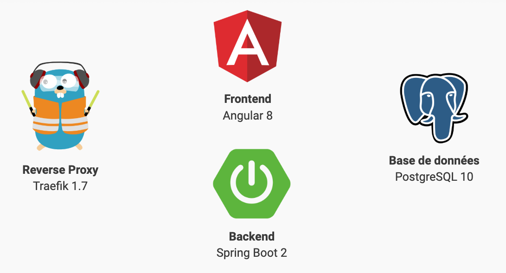

= SpringBoot2-Angular8-PostgreSQL-Docker

Angular 8 app with Spring Boot 2 backend and PostgreSQL database built and deployed with Docker.

== TL;DR

. Run with `docker-compose up -d`
. Go to http://demo-app.127.0.0.1.nip.io:8080

NOTE: SwaggerUI is available on http://api.demo-app.127.0.0.1.nip.io:8080/swagger-ui.html

== Demo : Build and deploy backend with Docker only

1) Build backend

[source,bash]
----
docker build -t springboot2-app springboot2-app/
----

2) Start database

[source,bash]
----
docker run --name database --rm \
-e POSTGRES_USER=springboot \
-e POSTGRES_PASSWORD=changeme \
postgres:10
----

3) Get database IP address

`docker inspect database`

NOTE: Find information under `Network / bridge / IPAddress`

4) Start backend

[source,bash]
----
docker run --name backend --rm \
-p 8090:8080 \
-e DATABASE_HOSTNAME=172.17.0.2 \
-e DATABASE_PORT=5432 \
-e DATABASE_USERNAME=springboot \
-e DATABASE_PASSWORD=changeme \
springboot2-app
----

5) Go to SwaggerUI to check

http://localhost:8090/swagger-ui.html#/employee-controller
